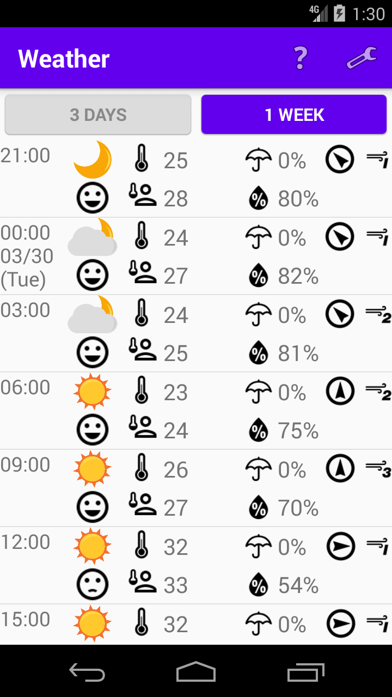
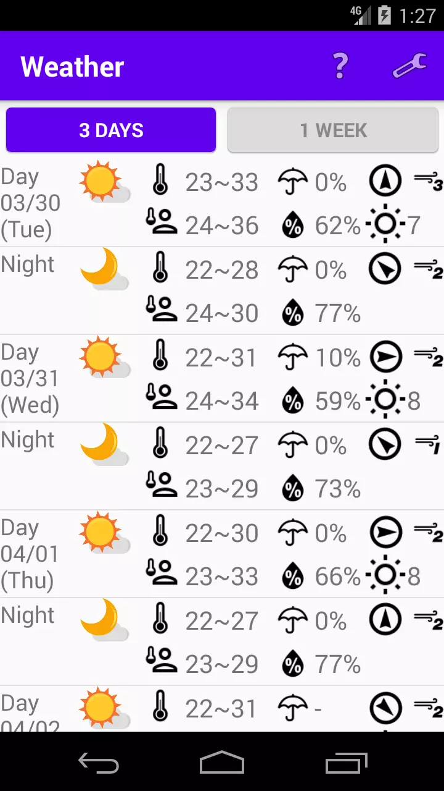
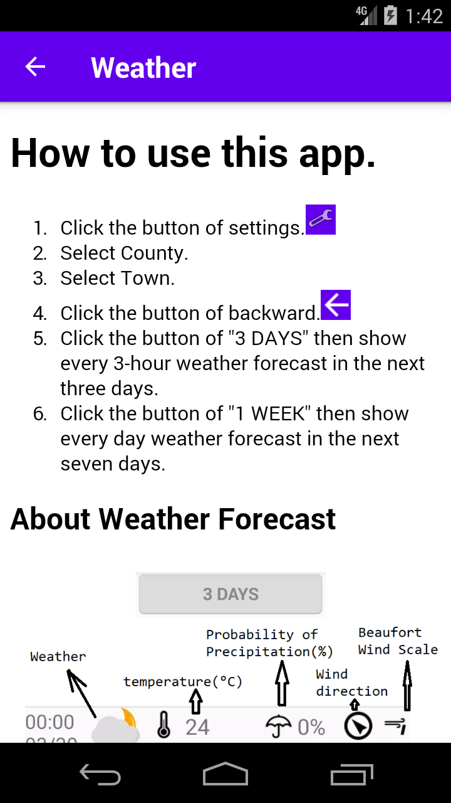
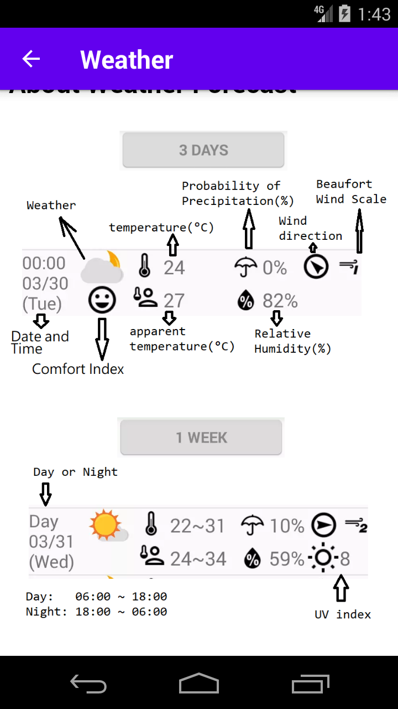
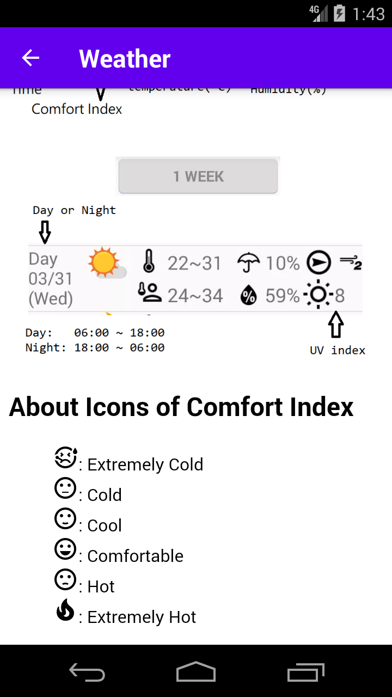

# Weather

Weather is an android app that display Taiwan's township weather forecast.

The source of Weather forecast is the website of [Central Weather Bureau](https://www.cwb.gov.tw).

## Purpose

The purpose of this project is to help me to get weather forecast quickly and easily. And learn android app development.

## Screenshots
     

## License

Please see [LICENSE](/LICENSE)